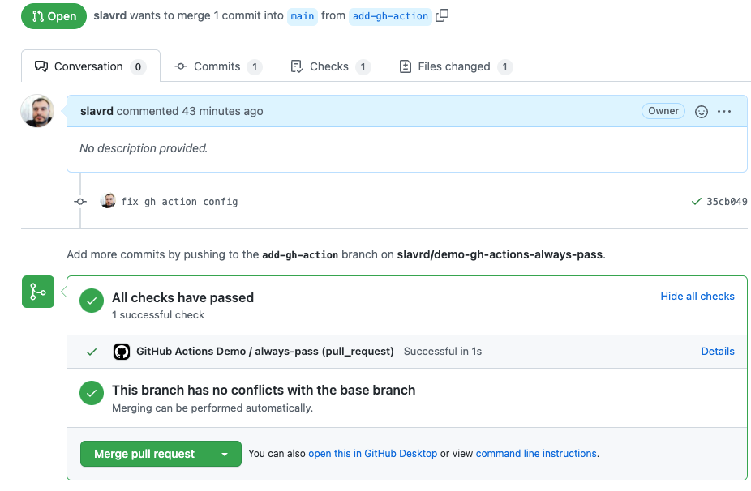

# Demo of GH Actions Always Pass

Simple Github Actions test that always passes

## Setup instructions

Follow the steps below

* Create a new repository on Github.
* Add the Github Actions configuration, same as it is in this repo in the `.github/workflows` directory.
* Open a Pull Request.

At this point a GitHub Action job would be triggered and a status check that passed would be posted in the PR details as shown on the screenshot below

